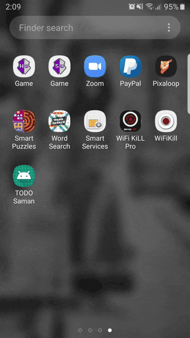
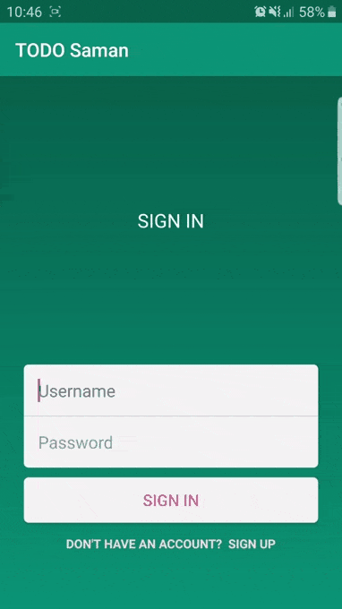

# TODO-SamanFinalProject

**Android Studio Version 3.6.0**

# Features

<table>
<thead>
<tr>
<th align="center">SplashScreen</th>
<th align="center">SignUp</th>
<th align="center">SignIn</th>
<th align="left">Add Task</th>
</tr>
</thead>
<tbody>
<tr>
<td align="center"> </td>
<td align="center"></td>
<td align="center"> </td>
<td align="left"></td>
</tr>
</tbody>
</table>

<table>
<thead>
<tr>
<th align="center">Edit Task</th>
<th align="center">Swipe To Delete</th>
<th align="center">Search Task</th>
<th align="left">Calendar</th>
</tr>
</thead>
<tbody>
<tr>
<td align="center"></td>
<td align="center"></td>
<td align="center"></td>
<td align="left"></td>
</tr>
</tbody>
</table>

<table>
<thead>
<tr>
<th align="center">Delete All Task</th>
<th align="center">Logout</th>
<th align="center">Exit</th>
</tr>
</thead>
<tbody>
<tr>
<td align="center"></td>
<td align="center"></td>
<td align="center"></td>
</tr>
</tbody>
</table>

